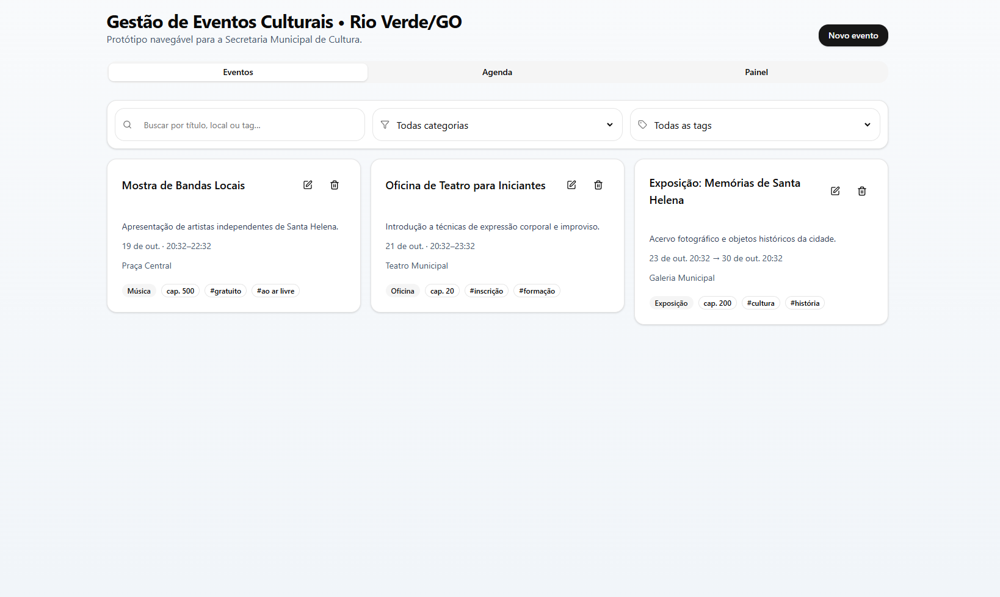
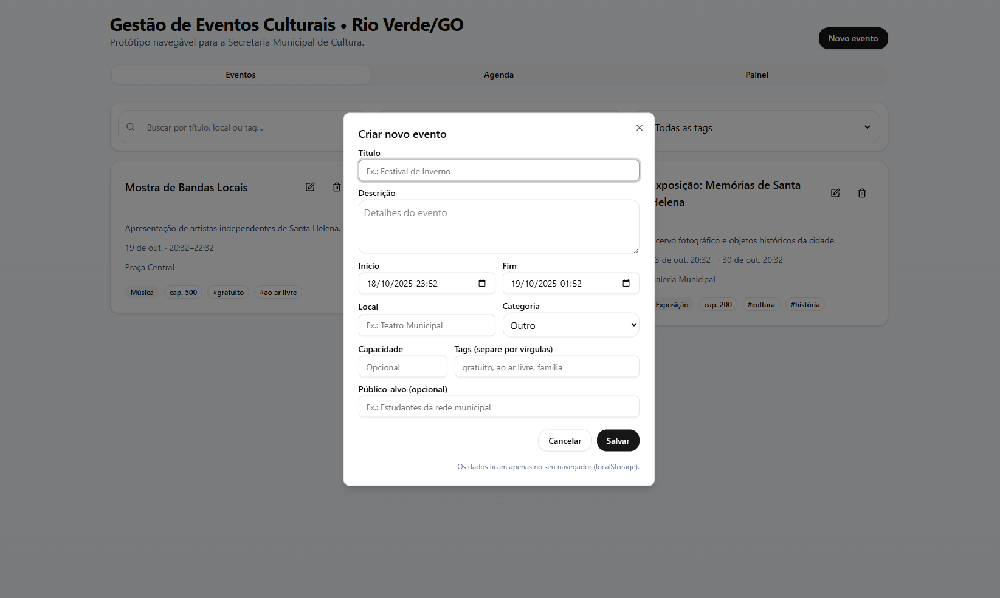

<h1 align="center">🎭 Gestão de Eventos Culturais – Rio Verde/GO</h1>

O sistema **Gestão de Eventos Culturais – Rio Verde/GO** é um protótipo de aplicação web voltado à **gestão de atividades culturais municipais**.  
A solução possibilita **criar, editar e excluir eventos**, visualizar uma **agenda interativa** e acompanhar **indicadores no painel administrativo**, tudo dentro de uma interface moderna construída com **React, Tailwind CSS e shadcn/ui**.

O projeto foi desenvolvido como parte de uma iniciativa de **extensão universitária** com foco na aplicação de práticas de engenharia de software, interface responsiva e uso de tecnologias modernas de front-end.

## 📸 Preview do Projeto

  
  

## 🧩 Funcionalidades

- ✅ **Cadastro de eventos** com título, descrição, local, categoria, data e tags  
- ✏️ **Edição e exclusão** de eventos existentes  
- 📅 **Visualização por agenda** (eventos agrupados por dia)  
- 📊 **Painel de controle** com métricas e estatísticas  
- 🔍 **Busca e filtros** por nome, categoria e tags  
- 💾 **Armazenamento local (localStorage)** – sem necessidade de backend  
- 💡 Interface **intuitiva, responsiva e acessível**

## 🚀 Tecnologias Utilizadas

- [Vite](https://vitejs.dev/): Ferramenta de build rápida para projetos React.
- [React](https://react.dev/): Biblioteca JavaScript para construção de interfaces de usuário.
- [Tailwind CSS](https://tailwindcss.com/): Framework de estilização utilitária para desenvolvimento rápido.
- [shadcn/ui](https://ui.shadcn.com/): Biblioteca de componentes de interface pré-construídos com Tailwind CSS.
- [Framer Motion](https://www.framer.com/motion/): Biblioteca de animações para React.
- [Lucide Icons](https://lucide.dev/): Biblioteca de ícones vetoriais para React.

## 🚀 Como executar o projeto

### Pré-requisitos

Antes de começar, você vai precisar ter instalado em sua máquina as seguintes ferramentas:

# 🧑🏻‍💻 Autor

Feito com ❤️ por Gelzieny R. Martins 👋🏽 [Entre em contato!](https://www.linkedin.com/in/gelzieny-r-martins-180551106/)
